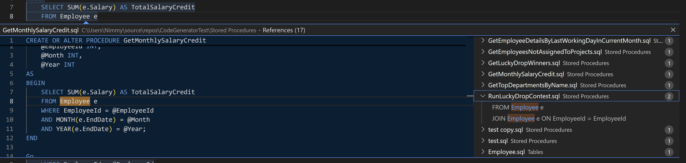
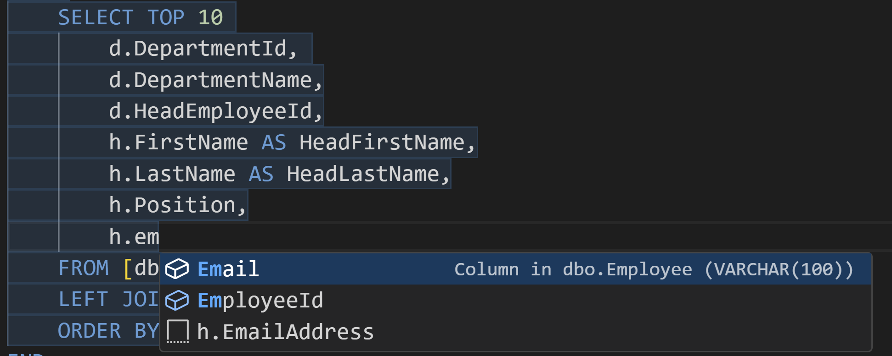
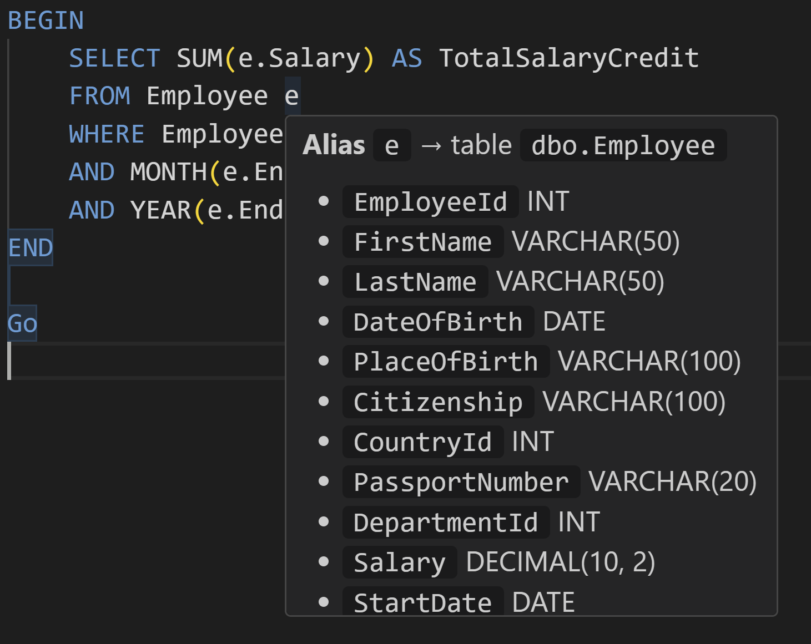

# SaralSQL — SQL IntelliSense & LSP for VS Code

> **Instant “Go to Definition” & IntelliSense for SQL — no database connection required.**  
> Built for teams that keep their schema in `.sql` files.  
> ⚡ **Indexes large projects (2000+ files) within a minute, and stays updated as you type**

---

## 💡 Why SaralSQL?

- **Offline-friendly** – works entirely from your source code, no live DB needed  
- **Privacy-friendly** – **no tracking; all code and actions stay in your workspace**  
- **Lightweight & fast** – hybrid regex + parser engine keeps typing latency low  
- **Code-centric** – ideal for projects that version-control schema scripts  
- **Zero-config** – open a folder of `.sql` files and start coding  
- **Scales to large projects** – indexes **2000+ SQL files in under 1 minute**

---

## ✨ Features

- **Go to Definition**  
  Jump to the definition of a table, type, or column in your workspace.  
  Works with both plain names (`Employee`) and aliases (`e.EmployeeId`).  

- **Find All References**  
  Locate table and column references across SQL files — skips matches in comments and unrelated identifiers.

- **IntelliSense / Auto-completion**  
  - Suggests table names and types  
  - After typing `alias.` or `TableName.`, column suggestions appear  
  - Schema prefixes handled automatically (`dbo.TableName` ↔ `TableName`)

- **Hover Information**  
  Hover over a table, alias, or column to see its definition and context.

- **Workspace Indexing**  
  - Automatically indexes all `.sql` files in the workspace  
  - **Indexes large codebases (1000+ files) in < 1 minute**  
  - Updates instantly as you type or save

- **Hybrid Regex + Parser Engine**  
  - Regex-based indexer ensures fast responses  
  - Lightweight SQL parser (`node-sql-parser`) adds accuracy in `FROM`/`JOIN` contexts and complex queries

---

## 🚀 Getting Started

1. Install the extension from the VS Code Marketplace  
2. Open a folder or workspace containing `.sql` files  
3. Start editing — features like definitions, references, completions, and hovers activate automatically  

> 💡 Works best when your schema objects (tables, types, procedures) are defined in `.sql` files within your workspace.

---

## ⚡ Performance

- Tested on real-world projects with **1000+ SQL files — full index in under 1 minute**  
- Designed to stay responsive even on large codebases

---

## ⚠️ Preview Notice

This is an **Early-Access Preview**:
- Optimized for **T-SQL / SQL Server** DDL & DML  
- Dialects like Postgres or MySQL may partially work but are not fully supported yet  
- Column and reference detection is heuristic — complex scripts may have misses or false positives  
- Certain constructs (e.g. `TOP(@Variable)`, `MERGE`, `OUTPUT INTO`) are still being improved

We’re releasing early to gather real-world feedback before expanding the feature set.

---

## 🛠 Planned Improvements

- **Outline View** for procedures, tables, and columns  
- **Workspace Symbol Search** (`Ctrl+T`) across SQL objects  
- **Diagnostics** for undefined tables/columns and duplicate definitions  
- **Better handling** of parameterised constructs like `TOP(@var)` and `OUTPUT INTO`  
- **Schema-aware resolution** for databases with duplicate table names across schemas  
- **Incremental indexing** for even faster performance on very large workspaces  
- **Custom T-SQL parser** if there’s enough user interest for full dialect coverage

---

## ⚠️ Known Limitations

This extension is intentionally lightweight and does **not** do full SQL semantic analysis.  
Be aware of these trade-offs:

- **Column References**  
  Column references are matched globally by name in regex fallback mode.  
  If multiple tables share a column name (e.g. `Id`), all may appear in references.  
  Teams using explicit names like `EmployeeId`, `DepartmentId` are less affected.

- **Bare Columns**  
  Bare columns (`SELECT EmployeeId`) resolve to their table only if the statement parses successfully.  
  In fallback (regex-only) mode, they’re treated as global and may be ambiguous.  
  Aliased usage (`e.EmployeeId`) is always more reliable.

- **Schemas**  
  `dbo.TableName` and `TableName` are treated the same.  
  Multiple schemas with the same table name are not yet distinguished.

- **Cross-File Consistency**  
  Accuracy depends on having all schema files in your workspace.

---

## 🧑‍💻 Contributing & Feedback

We welcome feedback and bug reports!  
- Open issues with sample SQL that doesn’t behave as expected  
- Pull requests are encouraged — especially for dialect support or smarter parsing  
- Share ideas for new features or parser improvements

---

## 📜 License
MIT License
