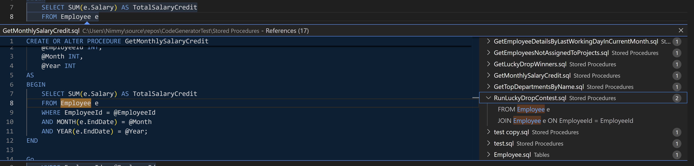
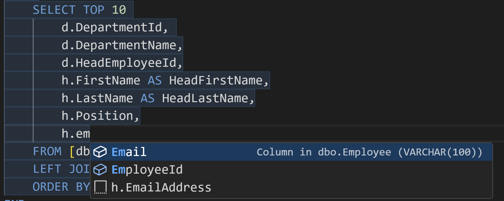
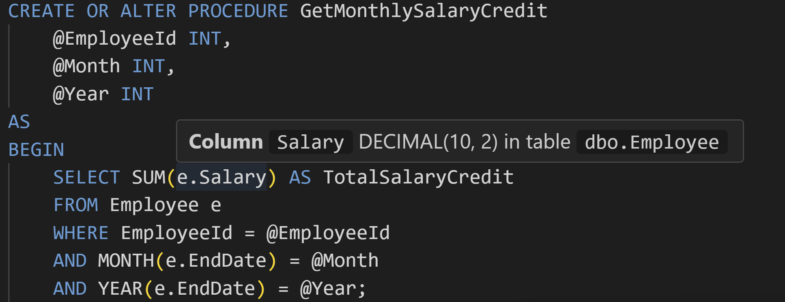
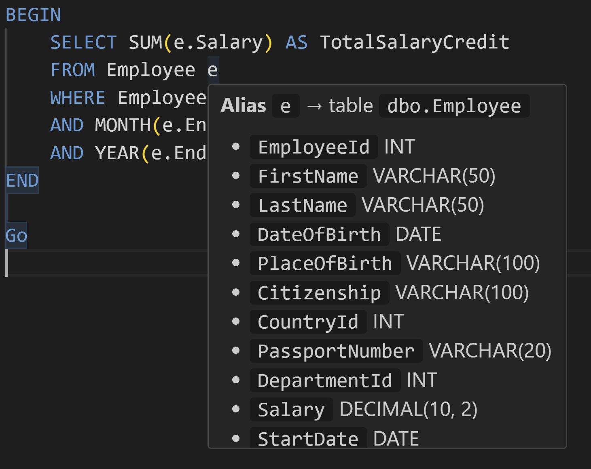
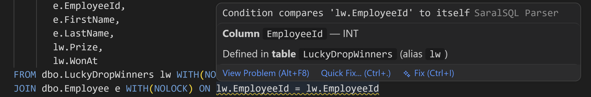
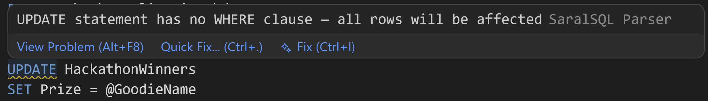
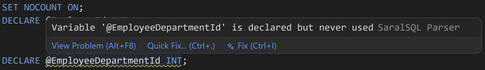

# SaralSQL — SQL IntelliSense & LSP for VS Code

> **Instant “Go to Definition” & IntelliSense for SQL — no database connection required.**  
> Built for teams that keep their entire schema in `.sql` files.  
> ⚡ **Indexes large projects (2000+ files) within a minute, and stays updated as you type**

---

## 💡 Why SaralSQL?

- **Offline-friendly** – works entirely from your source code, no live DB needed  
- **Privacy-friendly** – **no tracking; all code and actions stay in your workspace**  
- **Lightweight & fast** – advanced T-SQL parser engine keeps typing latency low  
- **Code-centric** – ideal for projects that version-control schema scripts  
- **Zero-config** – open a folder of `.sql` files and start coding with real-time diagnostics  
- **Scales to large projects** – indexes **2000+ SQL files in under 1 minute**

---

## ✨ Features

- **Go to Definition**  
  Jump to the definition of a table, type, or column in your workspace.  
  Works with both plain names (`Employee`) and aliases (`e.EmployeeId`).  

- **Find All References**  
  Locate table and column references across SQL files — skips matches in comments and unrelated identifiers.

- **IntelliSense / Auto-completion**  
  - Suggests table names and types  
  - After typing `alias.` or `TableName.`, column suggestions appear  
  - Schema prefixes handled automatically (`dbo.TableName` ↔ `TableName`)

- **Hover Information**  
  Hover over a table, alias, or column to see its definition and context.

- **Diagnostics & Error Checking**  
  Real-time parser-backed diagnostics using `@saralsql/tsql-parser`.  
  SaralSQL can highlight schema issues, unsafe statements, and semantic warnings as you type:
  - Unknown tables and columns
  - Conditions that compare a column to itself, such as `e.DepartmentId = e.DepartmentId`
  - `UPDATE` statements without a `WHERE` clause
  - Variables or parameters that are declared but never used
  - Readability hints for bare columns, with a quick fix to qualify them when a unique alias is available
  - Parser issues, when enabled from settings

  Diagnostics are enabled by default with `saralsql.showDiagnostics`. Parser issues are hidden by default with `saralsql.showParseIssues`; when parser issues are hidden, SaralSQL only shows other diagnostics after the document parses successfully. Schema diagnostics (unknown table/column and ambiguous bare columns) are opt-in via `saralsql.enableSchemaValidation` (default: off).

- **Workspace Indexing**  
  - Automatically indexes all `.sql` files in the workspace when workspace is opened in VS code
  - Updates instantly as you type or save

- **Parser-First Engine**  
  - Advanced T-SQL parser (`@saralsql/tsql-parser`) provides accurate semantic analysis, diagnostics, and complex query handling
  - Workspace indexing stays fast while semantic features use parser-backed scope and lineage data

---

## 🚀 Getting Started

1. Install the extension from the VS Code Marketplace  
2. Open a folder or workspace containing `.sql` files  
3. Start editing — features like definitions, references, completions, and hovers activate automatically  

> 💡 Works best when your schema objects (tables, types, procedures) are defined in `.sql` files within your workspace.

---

## ⚡ Performance

- Tested on real-world projects
- Designed to stay responsive even on large codebases

---

## ⚠️ Preview Notice

This is an **Early-Access Preview**:
- Optimized for **T-SQL / SQL Server** DDL & DML with advanced `@saralsql/tsql-parser`  
- Dialects like Postgres or MySQL may partially work but are not officially supported.  
- Real-time diagnostics now available for syntax and semantic validation, if you enable it from settings
- Column and reference detection uses parser-backed indexing and analysis
- Some editor behaviors around more complex statements are still being polished, even though the parser already understands constructs like `TOP(@Variable)`, `MERGE`, and `OUTPUT INTO`

We’re releasing early to gather real-world feedback before expanding the feature set.

---

## 🛠 Planned Improvements

- **Outline View** for procedures, tables, and columns  
- **Workspace Symbol Search** (`Ctrl+T`) across SQL objects  
- **Sharper editor behavior** around complex statement shapes and derived scopes  
- **Schema-aware resolution** for databases with duplicate table names across schemas  
- **Incremental indexing** for even faster performance on very large workspaces  
- **Enhanced dialect support** for Postgres, MySQL, and other SQL variants

---

## ⚠️ Known Limitations

This extension is intentionally lightweight and does **not** do full SQL semantic analysis.  
Be aware of these trade-offs:

- **Column References**  
  Column references are resolved from parser-backed scope and workspace index data.  
  When a column name is shared by multiple visible tables, the extension may warn that it is ambiguous rather than guessing.  
  Teams using explicit names like `EmployeeId` and `DepartmentId` are less affected.

- **Bare Columns**  
  Bare columns (`SELECT EmployeeId`) resolve to their table using advanced T-SQL parsing.  
  When the column is uniquely owned by a visible alias, SaralSQL can suggest qualifying it for readability and offer a quick fix.  
  Aliased usage (`e.EmployeeId`) is still the most explicit form.

- **Schemas**  
  `dbo.TableName` and `TableName` are treated the same.  
  Multiple schemas with the same table name are not yet distinguished.

- **Cross-File Consistency**  
  Accuracy depends on having all schema files in your workspace.

---

## 🧑‍💻 Contributing & Feedback

We welcome feedback and bug reports!  
- Open issues with sample SQL that doesn’t behave as expected  
- Pull requests are encouraged — especially for dialect support or smarter parsing  
- Share ideas for new features or parser improvements

---

## 📜 License
MIT License

---

## Regression Requirement

Every functional change must include at least one regression test that fails before the change and passes after.

This rule applies to fixes/features touching:
- parsing and AST shape
- scope/reference extraction
- hover/definition/reference/completion behavior
- diagnostics behavior

Default required test layer is parser + index unit-style coverage. LSP integration tests are required only when index-level tests cannot reliably prove the behavior.

Each PR must include a short **Regression scenario** note with:
- input SQL snippet
- expected behavior
- test name(s) covering the scenario

If no new test is added, the PR must state why existing tests already cover the change.
